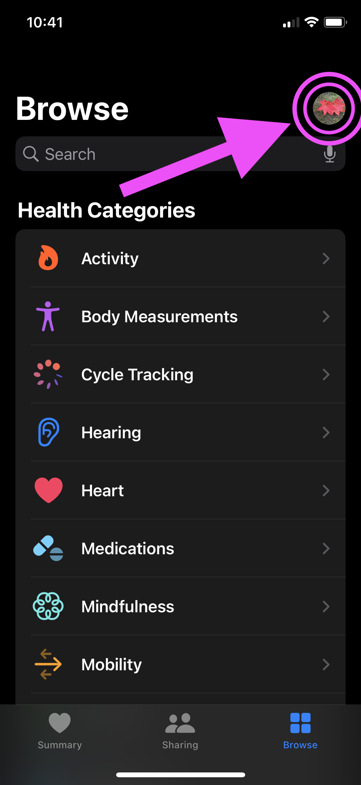
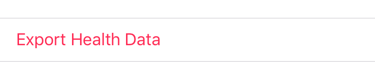
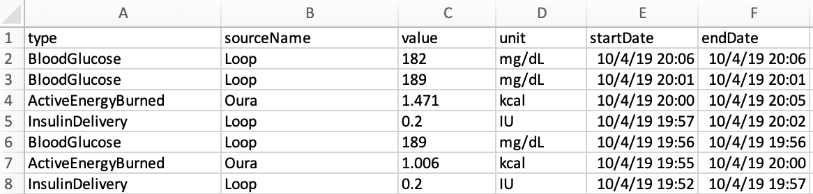

# Simple Apple Health XML to CSV

A simple script to convert Apple Health's export.xml file to an easy to use csv.

## How to Run 

### 1. Verify you have pandas installed on your machine or environment

`python -c "import pandas"` should return blank from the command line

If you get a _**ModuleNotFoundError: No module named 'pandas'**_ error, install pandas:

`pip install pandas`

### 2. Export your Apple Health Data

   Go to your health home screen and click on the profile icon

On the next page, click the "Export Health Data" button

Your data will be prepared, and then you can transfer the export.zip file to your machine.

### 3. Unzip the file, which should contain:

   * apple_health_export
     * export.xml
     
     * export_cda.xml
     
       

### 4. Place the "apple_health_xml_convert.py" file into the folder alongside the files and run the script

`python apple_health_xml_convert.py`

The export will be written with the format:

* **apple_health_export_YYYY-MM-DD.csv**

  

In Excel, the output should look something like this:

