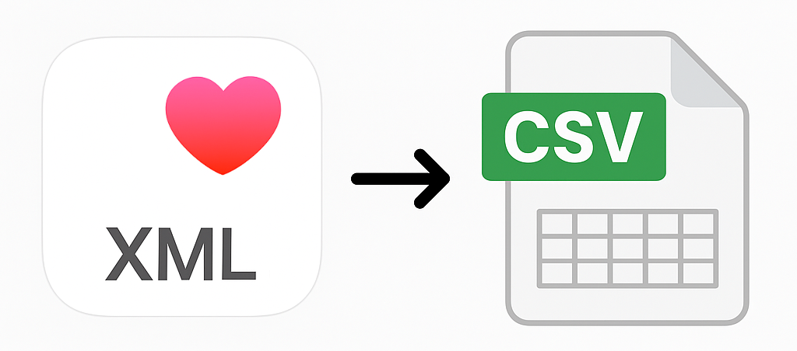
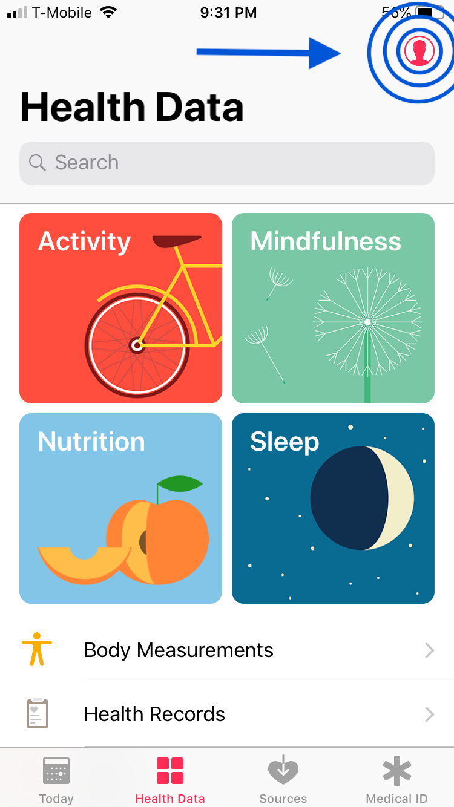
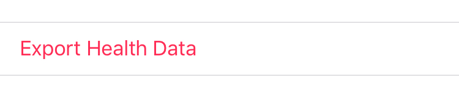
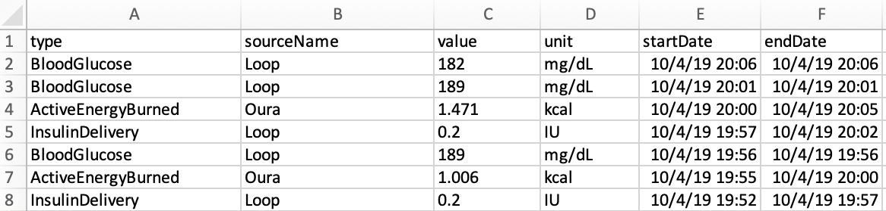

# Simple Apple Health XML to CSV

A Python script that converts the `export.xml` file from your Apple
Health export into a single CSV.

## Step 1: Check your Python version

This script requires **Python 3.8 or later**. Verify your version:

```
python3 --version
```

If you need to upgrade, download the latest Python from [python.org](https://www.python.org/downloads/).

## Step 2: Export your data from Apple Health

In the iPhone Health app, tap your profile icon → **Export All Health Data**.
Transfer the resulting `export.zip` to your machine.

| Health home | ➡️ | Export Data |
|--|--|--|
|  ||  |

## Step 3: Run the script

```
python3 apple_health_xml_convert.py
```

With no arguments, it searches the current directory for your export in this order:

1. `export.zip`
2. `apple_health_export/export.xml`
3. `export.xml`

The output is written as `apple_health_export_YYYY-MM-DD.csv` next to the input file.

To point at a specific file or change the output path:

```
python3 apple_health_xml_convert.py -i export.xml -o out.csv
```


In Excel the output looks something like this:



## Notes

- The `HKQuantityTypeIdentifier`, `HKCategoryTypeIdentifier`, and
  `HKCharacteristicTypeIdentifier` prefixes are stripped from `type` values
  and column names for legibility.
- Rows are written in document order (roughly chronological). If you want
  them sorted by date, sort the CSV with your tool of choice (e.g. `sort` or
  pandas).
- Memory stays bounded regardless of export size, so multi-GB exports work
  on modest hardware.

## License

BSD 2-Clause: See [LICENSE.md](LICENSE.md)
